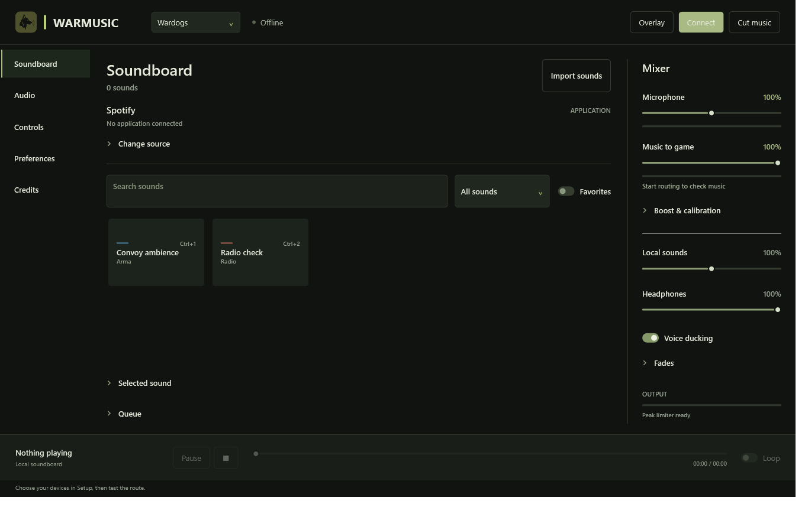
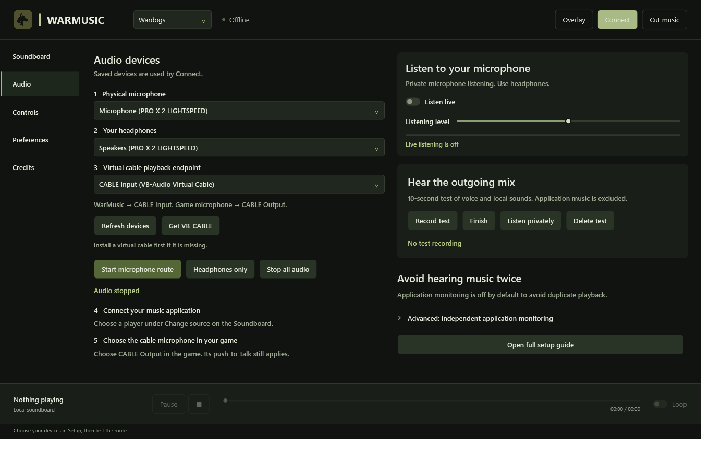
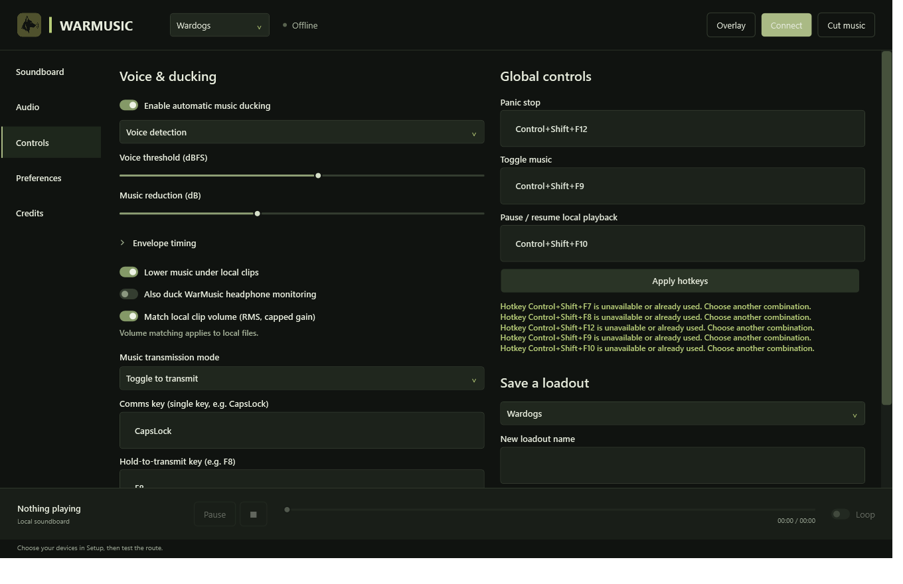
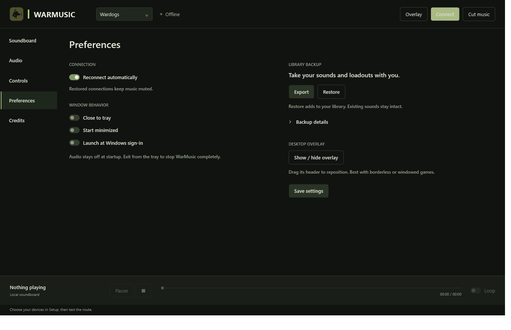

# WarMusic

Your mic, your music, one input.

WarMusic mixes your microphone, music from a desktop app, and local sound clips into a single microphone input for your game. It keeps the game's normal push-to-talk behavior and does not require a music-service login or API.



## Download

WarMusic supports Windows 11 x64 and requires [VB-CABLE](https://vb-audio.com/Cable/) or a compatible virtual cable. VB-CABLE is not bundled.

Release packages are self-contained, so users do not need to install .NET separately:

- `WarMusic-<version>-win-x64.exe` is the complete application in one standalone file.
- `WarMusic-<version>-win-x64-setup.msi` installs for all users and adds a Start Menu shortcut.
- `WarMusic-<version>-win-x64-portable.zip` runs entirely from an extracted writable folder.

After the public `WarMusic-Releases` repository is provisioned, download an artifact and verify it against `SHA256SUMS.txt`. Unsigned downloads can produce a Windows reputation warning; the ZIP and MSI payload also include `UNSIGNED-BUILD.txt`.

The standalone EXE and installed mode store settings, diagnostics, recordings, and imported sounds in `%LOCALAPPDATA%\WarMusic\data`. Portable mode is selected by the ZIP's `WarMusic.portable` marker or `--portable` and stores data beside `WarMusic.exe`.

On the first installed launch, adjacent legacy data is copied when present; the original remains untouched. To migrate from another folder, use **Preferences → Export/Restore**.

## Keep control of the mix

Set separate levels for your microphone, application music, local sounds, and headphones. Voice ducking lowers the music when you speak, then brings it back afterward.

Use fades for a gradual change or **Cut music** to silence music immediately while keeping your microphone live.

## Build your soundboard

Import WAV and MP3 files, organize them into collections, and assign hotkeys. Search your library, mark favorites, queue clips, or preview a sound privately before playing it.

Your local sounds and application music share the same outgoing mix.

## Connect your audio

1. In **Audio**, choose your physical microphone and headphones.
2. Select **CABLE Input** as the game output.
3. In your game, select **CABLE Output** as the microphone.
4. Click **Connect** in WarMusic.
5. Start playback in your music app and select it under **Change source**.
6. Enable music when you're ready.

Music starts muted. Your game's push-to-talk still applies.



## Make it yours

Adjust ducking, choose your hotkeys, and save loadouts for different setups.



Tray controls, optional Windows startup, a desktop overlay, library backups, and local audio health diagnostics are available in **Preferences**.



WarMusic has no telemetry, automatic updater, or runtime network dependency. See the [privacy statement](docs/PRIVACY.md).

## Troubleshooting

| Problem | What to check |
| --- | --- |
| No music in the game | Check that music is enabled, WarMusic sends to CABLE Input, and the game uses CABLE Output. |
| Music is too quiet | Open **Boost & calibration**, measure the source, and apply the suggested adjustment. |
| Echo or feedback | Use headphones and keep the headphone output separate from the cable. |
| Wardogs ignores the cable | Select another microphone in the game, apply it, then select CABLE Output again. This may need repeating each session. |

See the [setup guide](docs/SETUP.md) for detailed routing and troubleshooting.

## Build and test

Use Windows 11 x64 and the .NET SDK pinned by `global.json`:

```powershell
dotnet restore src/WarMusic/WarMusic.csproj --locked-mode -r win-x64
dotnet restore tests/WarMusic.UnitTests/WarMusic.UnitTests.csproj --locked-mode
dotnet build src/WarMusic/WarMusic.csproj -c Release --no-restore
dotnet test tests/WarMusic.UnitTests/WarMusic.UnitTests.csproj -c Release --no-restore
```

The deterministic suite reports each check independently. Device-dependent checks and the soak runner live in `tests/WarMusic.HardwareTests`; see the [hardware testing guide](docs/HARDWARE-TESTING.md).

Release packaging, signing, and public-repository setup are documented in the [release guide](docs/RELEASING.md). The packaging script emits the standalone EXE, MSI, portable ZIP, SHA-256 checksums, and build provenance.

## About

WarMusic captures application playback through Windows, including playback from Spotify. It does not use an official Spotify integration, and neither Spotify nor VB-CABLE is bundled.

WarMusic is not a replacement for a game's radio stack; it feeds the microphone device the game already exposes. Source visibility and licensing remain separate owner decisions. The public release repository distributes binaries and accepts issue reports only.

Creator links and the development disclaimer are in the app's **Credits** tab.

[Third-party notices](docs/THIRD-PARTY.md)
